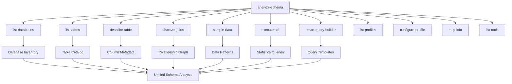

# Database Schema Analyzer - Design Document

## Table of Contents
1. [Overview](#overview)
2. [Tool Orchestration Architecture](#tool-orchestration-architecture)
3. [Progressive Analysis Levels](#progressive-analysis-levels)
4. [AI-Optimized Output Format](#ai-optimized-output-format)
5. [Business Context Inference](#business-context-inference)
6. [Data Pattern Recognition](#data-pattern-recognition)
7. [Semantic Relationship Mapping](#semantic-relationship-mapping)
8. [Query Suggestion Generation](#query-suggestion-generation)
9. [Data Quality Metrics](#data-quality-metrics)
10. [Implementation Workflow](#implementation-workflow)
11. [MCP Tool Parameters](#mcp-tool-parameters)
12. [Use Cases for AI Agents](#use-cases-for-ai-agents)
13. [Example Outputs](#example-outputs)

---

## Overview

### Purpose
The `analyze-schema` MCP tool provides comprehensive database schema analysis specifically designed to help AI Large Language Models (LLMs) understand databases for better query construction, data exploration, and intelligent database interactions.

### Key Innovation
Unlike traditional schema introspection tools, `analyze-schema` orchestrates the core discovery and analysis MCP tools to create a unified, AI-optimized understanding of database structure, relationships, and business context.

### Core Value Proposition
- **AI-First Design**: Output format optimized for LLM consumption and reasoning
- **Progressive Analysis**: Three levels of detail to match different AI use cases
- **Business Context**: Infers domain-specific meaning from table/column names and data patterns
- **Relationship Discovery**: Maps semantic connections beyond foreign keys
- **Query Readiness**: Provides concrete SQL suggestions and patterns

---

## Tool Orchestration Architecture

### Unified Tool Integration
The `analyze-schema` tool leverages key MCP tools for schema, relationship, sampling, and query guidance workflows:



### Orchestration Flow

1. **Discovery Phase**
   - [`list-databases`](internal/mcp/server.go:1885) - Enumerate available databases
   - [`list-tables`](internal/mcp/server.go:1402) - Catalog all tables and views
   - [`describe-table`](internal/mcp/server.go:1572) - Extract detailed column metadata

2. **Relationship Analysis**
   - [`discover-joins`](internal/mcp/server.go:371) - Map foreign key relationships
   - [`sample-data`](internal/mcp/server.go:2009) - Analyze data patterns and types

3. **Context Enrichment**
   - [`execute-sql`](internal/mcp/server.go:1057) - Run statistical queries
   - [`smart-query-builder`](internal/mcp/server.go:725) - Generate query patterns

4. **Synthesis**
   - Combine all data into AI-optimized output format
   - Apply business context inference algorithms
   - Generate semantic relationship mappings

---

## Progressive Analysis Levels

### Basic Level
**Use Case**: Quick database overview for AI agents starting exploration

**Tools Used**: `list-databases`, `list-tables`, basic `describe-table`

**Output Includes**:
- Database inventory with table counts
- High-level table categorization
- Primary key identification
- Basic relationship hints

**Example Scenario**: "What kind of data does this database contain?"

### Detailed Level
**Use Case**: Comprehensive schema understanding for query construction

**Tools Used**: Full `describe-table`, `discover-joins`, `sample-data`

**Output Includes**:
- Complete column metadata with constraints
- Foreign key relationship graph
- Data type patterns and value ranges
- Column naming convention analysis

**Example Scenario**: "Help me build complex queries across multiple tables"

### Comprehensive Level
**Use Case**: Deep business context understanding for advanced AI applications

**Tools Used**: All 11 tools with statistical queries via `execute-sql`

**Output Includes**:
- Business domain inference
- Data quality metrics
- Query performance hints
- Semantic relationship mapping
- Auto-generated query templates

**Example Scenario**: "Understand the business model and generate intelligent reports"

---

## AI-Optimized Output Format

### JSON Schema Structure

```json
{
  "analysis_metadata": {
    "analysis_level": "comprehensive",
    "database_type": "mysql",
    "analysis_timestamp": "2024-01-15T10:30:00Z",
    "tools_used": ["list-tables", "describe-table", "discover-joins", "sample-data"],
    "analysis_duration_ms": 2850
  },
  "database_overview": {
    "database_count": 3,
    "total_tables": 15,
    "total_columns": 147,
    "estimated_business_domain": "e-commerce",
    "confidence_score": 0.89
  },
  "table_catalog": {
    "core_entities": [...],
    "lookup_tables": [...],
    "junction_tables": [...],
    "audit_tables": [...]
  },
  "relationship_graph": {
    "foreign_keys": [...],
    "semantic_relationships": [...],
    "suggested_joins": [...]
  },
  "business_context": {
    "domain_indicators": [...],
    "naming_conventions": [...],
    "data_patterns": [...]
  },
  "ai_query_suggestions": {
    "common_patterns": [...],
    "business_questions": [...],
    "performance_optimized": [...]
  }
}
```

### LLM-Friendly Features

1. **Natural Language Descriptions**: Every technical element includes human-readable explanation
2. **Confidence Scores**: AI can gauge reliability of inferences
3. **Query-Ready Examples**: Concrete SQL snippets for immediate use
4. **Context Hints**: Business domain clues for better query generation
5. **Error Prevention**: Common pitfalls and suggested alternatives

---

## Business Context Inference

### Domain Detection Algorithm

```python
# Pseudo-code for business domain inference
def infer_business_domain(tables, columns, sample_data):
    domain_indicators = {
        'e-commerce': ['products', 'orders', 'customers', 'cart', 'payment'],
        'hr': ['employees', 'departments', 'salaries', 'attendance'],
        'finance': ['accounts', 'transactions', 'ledger', 'invoices'],
        'healthcare': ['patients', 'appointments', 'treatments', 'medical'],
        'education': ['students', 'courses', 'grades', 'enrollment']
    }
    
    scores = calculate_domain_scores(table_names, column_names, domain_indicators)
    return highest_scoring_domain_with_confidence()
```

### Naming Convention Analysis

- **PascalCase/camelCase**: Modern application patterns
- **snake_case**: Traditional database conventions  
- **Prefixed tables**: Enterprise system indicators
- **Audit columns**: `created_at`, `updated_at`, `deleted_at`
- **Foreign key patterns**: `*_id`, `*Id` suffixes

### Business Entity Recognition

```json
{
  "core_entities": {
    "users": {
      "business_role": "primary_actor",
      "entity_type": "person",
      "key_attributes": ["email", "name", "status"],
      "relationship_centrality": 0.85
    },
    "products": {
      "business_role": "core_asset", 
      "entity_type": "item",
      "key_attributes": ["name", "price", "category"],
      "relationship_centrality": 0.72
    }
  }
}
```

---

## Data Pattern Recognition

### Column Analysis Patterns

1. **Identifier Patterns**
   - UUIDs: `36-character` strings with hyphens
   - Auto-increment: Integer primary keys
   - Natural keys: Email, username, SKU patterns

2. **Temporal Patterns**
   - Creation timestamps: `created_at`, `date_created`
   - Modification tracking: `updated_at`, `modified_date`
   - Soft deletes: `deleted_at`, `is_deleted`

3. **Status/State Patterns**
   - Enums: Limited distinct values
   - Boolean flags: `is_*`, `has_*`, `can_*`
   - Status workflows: `pending`, `active`, `archived`

4. **Measurement Patterns**
   - Currency: `DECIMAL(10,2)` columns named `*_amount`, `*_price`
   - Quantities: Integer columns with `quantity`, `count`, `total`
   - Percentages: `DECIMAL` between 0-100 or 0-1

### Sample Data Analysis

```json
{
  "data_patterns": {
    "email": {
      "pattern_type": "email_address",
      "validation_regex": "^[\\w\\.-]+@[\\w\\.-]+\\.[a-zA-Z]{2,}$",
      "uniqueness": 0.99,
      "null_percentage": 0.02
    },
    "price": {
      "pattern_type": "currency",
      "decimal_places": 2,
      "range": {"min": 0.99, "max": 999.99},
      "distribution": "log_normal"
    }
  }
}
```

---

## Semantic Relationship Mapping

### Beyond Foreign Keys

While [`discover-joins`](internal/mcp/server.go:371) finds formal foreign key relationships, semantic analysis identifies implicit relationships:

1. **Naming Conventions**
   - `user_id` in multiple tables → User centrality
   - `*_date` columns → Temporal relationships
   - Similar column names → Potential joins

2. **Data Correlation**
   - Matching value ranges across tables
   - Overlapping unique identifiers
   - Temporal sequence patterns

3. **Business Logic Inference**
   - Order → LineItems (one-to-many)
   - Users → Roles (many-to-many via junction)
   - Categories → Subcategories (self-referential)

### Relationship Confidence Scoring

```json
{
  "semantic_relationships": [
    {
      "from_table": "orders",
      "to_table": "users", 
      "relationship_type": "many_to_one",
      "connection_basis": "naming_convention",
      "confidence_score": 0.95,
      "suggested_join": "orders.user_id = users.id",
      "business_meaning": "Each order belongs to a specific user"
    }
  ]
}
```

---

## Query Suggestion Generation

### Pattern-Based Templates

Using [`smart-query-builder`](internal/mcp/server.go:725) insights:

1. **CRUD Operations**
   ```sql
   -- User management
   SELECT * FROM users WHERE status = 'active';
   INSERT INTO users (email, name) VALUES (?, ?);
   UPDATE users SET last_login = NOW() WHERE id = ?;
   ```

2. **Business Intelligence**
   ```sql
   -- Sales analysis
   SELECT DATE(created_at), COUNT(*), SUM(total_amount)
   FROM orders 
   WHERE created_at >= DATE_SUB(NOW(), INTERVAL 30 DAY)
   GROUP BY DATE(created_at);
   ```

3. **Data Quality Checks**
   ```sql
   -- Find orphaned records
   SELECT * FROM order_items oi
   LEFT JOIN orders o ON oi.order_id = o.id
   WHERE o.id IS NULL;
   ```

### AI-Optimized Query Suggestions

```json
{
  "ai_query_suggestions": {
    "data_exploration": [
      {
        "question": "What are the most popular products?",
        "sql": "SELECT p.name, COUNT(*) as order_count FROM products p JOIN order_items oi ON p.id = oi.product_id GROUP BY p.id ORDER BY order_count DESC LIMIT 10",
        "complexity": "medium",
        "estimated_rows": 10
      }
    ],
    "business_intelligence": [
      {
        "question": "Monthly revenue trend",
        "sql": "SELECT DATE_FORMAT(created_at, '%Y-%m') as month, SUM(total_amount) as revenue FROM orders WHERE created_at >= DATE_SUB(NOW(), INTERVAL 12 MONTH) GROUP BY month ORDER BY month",
        "complexity": "easy",
        "visualization_hint": "line_chart"
      }
    ]
  }
}
```

---

## Data Quality Metrics

### Statistical Analysis via [`execute-sql`](internal/mcp/server.go:1057)

```sql
-- Completeness metrics
SELECT 
  'users' as table_name,
  'email' as column_name,
  COUNT(*) as total_rows,
  COUNT(email) as non_null_count,
  (COUNT(email) * 100.0 / COUNT(*)) as completeness_percentage
FROM users;

-- Uniqueness analysis  
SELECT 
  COUNT(*) as total_rows,
  COUNT(DISTINCT email) as unique_values,
  (COUNT(DISTINCT email) * 100.0 / COUNT(*)) as uniqueness_percentage
FROM users;
```

### Quality Score Calculation

```json
{
  "data_quality_metrics": {
    "users.email": {
      "completeness": 0.98,
      "uniqueness": 0.99,
      "validity": 0.97,
      "consistency": 0.95,
      "overall_score": 0.97,
      "quality_issues": [
        "2% null values detected",
        "3 invalid email formats found"
      ]
    }
  }
}
```

---

## Implementation Workflow

### Execution Sequence

```go
func (s *MCPServer) handleAnalyzeSchema(ctx context.Context, session *mcp.ServerSession, params *mcp.CallToolParamsFor[AnalyzeSchemaParams]) (*mcp.CallToolResultFor[any], error) {
    
    // 1. Parameter validation and setup
    p := params.Arguments
    level := p.AnalysisLevel // "basic", "detailed", "comprehensive"
    
    // 2. Database discovery
    databases := s.callListDatabases(p.ProfileName)
    tables := s.callListTables(p.ProfileName, p.DatabaseName)
    
    // 3. Schema analysis (level-dependent)
    tableSchemas := make(map[string]DescribeTableResult)
    for _, table := range tables {
        schema := s.callDescribeTable(p.ProfileName, p.DatabaseName, table)
        tableSchemas[table] = schema
    }
    
    // 4. Relationship discovery
    relationships := s.callDiscoverJoins(p.ProfileName, tables)
    
    // 5. Data sampling (detailed+ levels)
    if level != "basic" {
        sampleData := s.collectSampleData(p.ProfileName, p.DatabaseName, tables)
    }
    
    // 6. Statistical analysis (comprehensive level)
    if level == "comprehensive" {
        qualityMetrics := s.calculateDataQuality(p.ProfileName, p.DatabaseName, tables)
        queryPatterns := s.generateQuerySuggestions(p.ProfileName, tableSchemas, relationships)
    }
    
    // 7. Business context inference
    businessContext := s.inferBusinessContext(tables, tableSchemas, sampleData)
    
    // 8. Semantic relationship mapping
    semanticRelationships := s.mapSemanticRelationships(tableSchemas, relationships, businessContext)
    
    // 9. Generate AI-optimized output
    result := s.synthesizeAnalysisResult(level, databases, tables, tableSchemas, relationships, businessContext, semanticRelationships)
    
    return result, nil
}
```

### Helper Methods

```go
// Orchestration helpers
func (s *MCPServer) callListDatabases(profileName string) []string
func (s *MCPServer) callListTables(profileName, databaseName string) []string  
func (s *MCPServer) callDescribeTable(profileName, databaseName, tableName string) DescribeTableResult
func (s *MCPServer) callDiscoverJoins(profileName string, tables []string) DiscoverJoinsResult
func (s *MCPServer) callSampleData(profileName, databaseName, tableName string, size int) SampleDataResult

// Analysis algorithms
func (s *MCPServer) inferBusinessContext(tables []string, schemas map[string]DescribeTableResult, samples map[string]SampleDataResult) BusinessContext
func (s *MCPServer) mapSemanticRelationships(schemas map[string]DescribeTableResult, fkRelationships DiscoverJoinsResult, context BusinessContext) []SemanticRelationship
func (s *MCPServer) calculateDataQuality(profileName, databaseName string, tables []string) map[string]QualityMetrics
func (s *MCPServer) generateQuerySuggestions(profileName string, schemas map[string]DescribeTableResult, relationships DiscoverJoinsResult) []QuerySuggestion
```

---

## MCP Tool Parameters

### Input Parameters

```go
type AnalyzeSchemaParams struct {
    ProfileName    string   `json:"profile_name"`              // Required: Database profile to analyze
    DatabaseName   string   `json:"database_name,omitempty"`   // Optional: Specific database (uses profile default if empty)
    AnalysisLevel  string   `json:"analysis_level,omitempty"`  // Optional: "basic", "detailed", "comprehensive" (default: "detailed")
    IncludeTables  []string `json:"include_tables,omitempty"`  // Optional: Specific tables to analyze (all if empty)
    ExcludeTables  []string `json:"exclude_tables,omitempty"`  // Optional: Tables to exclude from analysis
    SampleSize     int      `json:"sample_size,omitempty"`     // Optional: Rows to sample per table (default: 10)
    IncludeQueries bool     `json:"include_queries,omitempty"` // Optional: Generate query suggestions (default: true)
}
```

### Usage Examples

```json
// Basic analysis
{
  "profile_name": "production_db",
  "database_name": "ecommerce",
  "analysis_level": "basic"
}

// Detailed analysis with specific tables
{
  "profile_name": "analytics_db", 
  "database_name": "warehouse",
  "analysis_level": "detailed",
  "include_tables": ["orders", "customers", "products"],
  "sample_size": 20
}

// Comprehensive analysis
{
  "profile_name": "main_db",
  "analysis_level": "comprehensive",
  "include_queries": true
}
```

---

## Use Cases for AI Agents

### 1. Database Discovery Agent
**Scenario**: AI agent needs to understand a new database for the first time

**Workflow**:
1. Call `analyze-schema` with `analysis_level: "basic"`
2. Review database overview and table categorization
3. Identify core business entities and relationships
4. Follow up with detailed analysis on key tables

**Expected Output**: High-level understanding suitable for conversation

### 2. Query Construction Assistant
**Scenario**: AI needs to build complex analytical queries

**Workflow**:
1. Call `analyze-schema` with `analysis_level: "detailed"`
2. Study relationship graph and join patterns
3. Use suggested query templates as starting points
4. Validate column names and data types

**Expected Output**: Query-ready schema understanding with join suggestions

### 3. Business Intelligence Agent  
**Scenario**: AI generating executive dashboards and reports

**Workflow**:
1. Call `analyze-schema` with `analysis_level: "comprehensive"`
2. Parse business context and domain indicators
3. Use AI query suggestions for business questions
4. Apply data quality metrics for result confidence

**Expected Output**: Business-aware schema analysis with KPI suggestions

### 4. Data Migration Planner
**Scenario**: AI planning database modernization or integration

**Workflow**:
1. Analyze multiple databases with comprehensive level
2. Compare naming conventions and patterns
3. Identify semantic relationship overlaps
4. Generate migration strategy recommendations

**Expected Output**: Cross-database compatibility analysis

### 5. Automated Documentation Generator
**Scenario**: AI creating technical documentation for developers

**Workflow**:
1. Run comprehensive analysis on all databases
2. Extract business context and relationship explanations
3. Generate human-readable schema documentation
4. Include query examples and best practices

**Expected Output**: Documentation-ready schema descriptions

---

## Example Outputs

### Basic Level Example

```json
{
  "analysis_metadata": {
    "analysis_level": "basic",
    "database_type": "mysql",
    "analysis_timestamp": "2024-01-15T10:30:00Z",
    "tools_used": ["list-databases", "list-tables", "describe-table"],
    "analysis_duration_ms": 850
  },
  "database_overview": {
    "database_count": 1,
    "total_tables": 8,
    "total_columns": 67,
    "estimated_business_domain": "e-commerce",
    "confidence_score": 0.89,
    "summary": "E-commerce database with core entities for users, products, orders, and related lookup tables"
  },
  "table_catalog": {
    "core_entities": [
      {
        "table_name": "users",
        "business_role": "primary_actor",
        "column_count": 12,
        "primary_key": "id",
        "estimated_rows": "~50k"
      },
      {
        "table_name": "products", 
        "business_role": "core_asset",
        "column_count": 15,
        "primary_key": "id",
        "estimated_rows": "~5k"
      }
    ],
    "lookup_tables": [
      {
        "table_name": "categories",
        "business_role": "classification",
        "column_count": 4,
        "primary_key": "id"
      }
    ]
  },
  "quick_insights": [
    "Standard e-commerce model with user-centric design",
    "Well-normalized schema with proper foreign key relationships", 
    "Audit trail columns present (created_at, updated_at)",
    "No obvious data quality red flags detected"
  ]
}
```

### Detailed Level Example

```json
{
  "analysis_metadata": {
    "analysis_level": "detailed",
    "database_type": "postgresql", 
    "analysis_timestamp": "2024-01-15T10:35:00Z",
    "tools_used": ["list-tables", "describe-table", "discover-joins", "sample-data"],
    "analysis_duration_ms": 2150
  },
  "database_overview": {
    "total_tables": 12,
    "total_columns": 89,
    "total_relationships": 15,
    "estimated_business_domain": "project_management",
    "confidence_score": 0.92
  },
  "table_schemas": {
    "projects": {
      "column_count": 8,
      "key_columns": {
        "primary_key": "id", 
        "foreign_keys": ["owner_id"],
        "unique_columns": ["slug"],
        "indexed_columns": ["status", "created_at"]
      },
      "data_patterns": {
        "status": {
          "type": "enum",
          "values": ["draft", "active", "completed", "archived"],
          "distribution": {"active": 0.45, "completed": 0.30}
        },
        "name": {
          "type": "string",
          "max_length": 255,
          "null_percentage": 0.0,
          "uniqueness": 0.98
        }
      }
    }
  },
  "relationship_graph": {
    "foreign_keys": [
      {
        "from_table": "projects",
        "from_column": "owner_id", 
        "to_table": "users",
        "to_column": "id",
        "relationship_type": "many_to_one",
        "suggested_join": "projects p JOIN users u ON p.owner_id = u.id"
      }
    ],
    "semantic_relationships": [
      {
        "tables": ["projects", "tasks"],
        "relationship_type": "one_to_many",
        "connection_basis": "naming_convention",
        "confidence_score": 0.95,
        "business_meaning": "Projects contain multiple tasks"
      }
    ]
  },
  "query_patterns": {
    "common_joins": [
      "SELECT p.name, u.email FROM projects p JOIN users u ON p.owner_id = u.id",
      "SELECT p.name, COUNT(t.id) as task_count FROM projects p LEFT JOIN tasks t ON p.id = t.project_id GROUP BY p.id"
    ],
    "business_questions": [
      {
        "question": "Which users have the most active projects?",
        "sql": "SELECT u.name, COUNT(p.id) FROM users u JOIN projects p ON u.id = p.owner_id WHERE p.status = 'active' GROUP BY u.id ORDER BY COUNT(p.id) DESC"
      }
    ]
  }
}
```

### Comprehensive Level Example

```json
{
  "analysis_metadata": {
    "analysis_level": "comprehensive",
    "database_type": "mysql",
    "analysis_timestamp": "2024-01-15T10:40:00Z", 
    "tools_used": ["list-databases", "list-tables", "describe-table", "discover-joins", "sample-data", "execute-sql", "smart-query-builder"],
    "analysis_duration_ms": 4200
  },
  "database_overview": {
    "database_count": 3,
    "total_tables": 24,
    "total_columns": 187,
    "total_relationships": 31,
    "estimated_business_domain": "healthcare",
    "confidence_score": 0.94,
    "business_model_insights": [
      "Patient-centric healthcare system",
      "Appointment-based scheduling model", 
      "Electronic health records (EHR) structure",
      "Insurance and billing integration"
    ]
  },
  "business_context": {
    "domain_indicators": {
      "healthcare": 0.94,
      "evidence": ["patients", "appointments", "treatments", "medical_records", "prescriptions"]
    },
    "naming_conventions": {
      "pattern": "snake_case",
      "consistency_score": 0.91,
      "foreign_key_pattern": "*_id",
      "audit_columns": ["created_at", "updated_at", "deleted_at"]
    },
    "entity_relationships": {
      "central_entities": ["patients", "providers", "appointments"],
      "relationship_density": 0.67,
      "max_relationship_depth": 4
    }
  },
  "data_quality_metrics": {
    "patients.email": {
      "completeness": 0.95,
      "uniqueness": 0.99, 
      "validity": 0.97,
      "overall_score": 0.97,
      "issues": ["5% missing emails", "3 invalid formats"]
    },
    "appointments.appointment_date": {
      "completeness": 1.0,
      "temporal_consistency": 0.98,
      "business_rule_compliance": 0.95,
      "issues": ["2% appointments scheduled in past", "5% outside business hours"]
    }
  },
  "ai_query_suggestions": {
    "data_exploration": [
      {
        "category": "patient_analytics",
        "question": "What is the patient appointment frequency distribution?",
        "sql": "SELECT patient_id, COUNT(*) as appointment_count FROM appointments WHERE appointment_date >= DATE_SUB(NOW(), INTERVAL 1 YEAR) GROUP BY patient_id ORDER BY appointment_count DESC",
        "business_value": "Identify high-frequency patients for care management",
        "complexity": "medium"
      }
    ],
    "operational_queries": [
      {
        "category": "scheduling",
        "question": "Which providers have availability this week?",
        "sql": "SELECT p.name, COUNT(a.id) as booked_slots FROM providers p LEFT JOIN appointments a ON p.id = a.provider_id AND DATE(a.appointment_date) BETWEEN CURDATE() AND DATE_ADD(CURDATE(), INTERVAL 7 DAY) GROUP BY p.id HAVING booked_slots < 40",
        "business_value": "Optimize appointment scheduling",
        "performance_hint": "Index on appointment_date recommended"
      }
    ],
    "compliance_queries": [
      {
        "category": "data_integrity", 
        "question": "Find patients without required emergency contacts",
        "sql": "SELECT p.id, p.name FROM patients p LEFT JOIN emergency_contacts ec ON p.id = ec.patient_id WHERE ec.patient_id IS NULL",
        "business_value": "Ensure regulatory compliance",
        "urgency": "high"
      }
    ]
  },
  "semantic_insights": {
    "business_processes": [
      {
        "process": "patient_onboarding",
        "tables_involved": ["patients", "emergency_contacts", "insurance_info"],
        "typical_workflow": "Patient registration → Emergency contact entry → Insurance verification",
        "automation_opportunities": ["Duplicate patient detection", "Insurance verification API"]
      },
      {
        "process": "appointment_lifecycle", 
        "tables_involved": ["appointments", "providers", "patients", "medical_records"],
        "typical_workflow": "Appointment creation → Provider assignment → Consultation → Record documentation",
        "optimization_opportunities": ["Provider availability optimization", "No-show prediction"]
      }
    ],
    "kpi_suggestions": [
      {
        "kpi": "Patient Satisfaction Score",
        "calculation": "AVG(rating) FROM appointment_feedback WHERE appointment_date >= DATE_SUB(NOW(), INTERVAL 3 MONTH)",
        "benchmark": "> 4.0 (5-point scale)"
      },
      {
        "kpi": "Provider Utilization Rate", 
        "calculation": "(Booked appointments / Available slots) * 100",
        "benchmark": "80-90% optimal range"
      }
    ]
  },
  "performance_optimization": {
    "recommended_indexes": [
      {
        "table": "appointments",
        "columns": ["appointment_date", "provider_id"],
        "reason": "Frequent date range and provider filtering"
      },
      {
        "table": "medical_records", 
        "columns": ["patient_id", "created_at"],
        "reason": "Patient history chronological queries"
      }
    ],
    "query_patterns": {
      "avoid": [
        "SELECT * FROM large_tables without WHERE clause",
        "Unindexed JOIN operations on appointment_date"
      ],
      "prefer": [
        "Use provider_id index for provider-specific queries",
        "Limit historical data queries with date ranges"
      ]
    }
  }
}
```

---

## Technical Implementation Notes

### Error Handling
- Graceful degradation when individual tools fail
- Partial results with warnings for incomplete analysis  
- Structured error responses following existing MCP error format

### Performance Considerations
- Configurable sampling sizes to balance accuracy vs. speed
- Async tool execution where possible
- Caching of intermediate results for repeated analysis

### Security & Privacy
- Respects existing profile read-only flags
- No sensitive data in sample outputs
- Statistical aggregation only for data quality metrics

### Extensibility
- Plugin architecture for domain-specific analyzers
- Configurable business context rules
- Custom query pattern templates

---

This design document provides a comprehensive blueprint for implementing the `analyze-schema` MCP tool that truly helps AI agents understand databases at a semantic level, going far beyond traditional schema introspection to provide business context, relationship insights, and query-ready intelligence.
