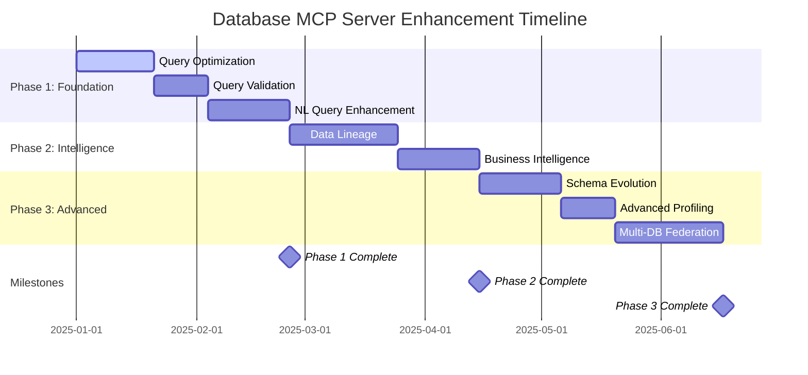

# Database MCP Server - Implementation Roadmap

## Overview

This document provides a high-level overview of the Database MCP Server enhancement roadmap based on the PRD analysis recommendations. It outlines the strategic direction for transforming the current production-ready MCP server into an AI-enhanced database interaction platform.

## Current State

The Database MCP Server is currently production-ready with:
- ✅ 12 comprehensive MCP tools fully implemented
- ✅ Multi-database support (MySQL, MariaDB, PostgreSQL, SQLite)
- ✅ Robust security with AES-GCM encryption
- ✅ Comprehensive documentation and testing
- ✅ Strong architectural foundation
- ✅ Toolchain: Go 1.25.5 (current)

## Strategic Vision

Transform the Database MCP Server into an intelligent database interaction platform that:
- **Anticipates Needs**: Proactively suggests optimizations and insights
- **Understands Context**: Maintains conversation context and business domain knowledge
- **Ensures Quality**: Validates queries and analyzes data quality automatically
- **Tracks Evolution**: Monitors schema changes and data lineage over time
- **Integrates Seamlessly**: Works across multiple databases with federation capabilities

## Enhancement Phases

### Phase 1: Foundation Intelligence (60 Days)

**Goal**: Establish core AI-enhancement capabilities that provide immediate value

#### Vertical Slices:
1. **Query Optimization Insights** - Intelligent query analysis and optimization suggestions
2. **Query Validation Framework** - Comprehensive SQL validation without execution
3. **Enhanced Natural Language Processing** - Context-aware, conversational query interface

#### Key Deliverables:
- `optimize-query` MCP tool for performance analysis
- `validate-query` MCP tool for SQL validation
- Enhanced `smart-query-builder` with conversation support
- Context management system for AI interactions

#### Expected Impact:
- 40% reduction in poorly performing queries
- 60% fewer SQL errors in production
- Significantly improved AI agent query success rate

---

### Phase 2: Business Intelligence Layer (49 Days)

**Goal**: Add intelligent data analysis and business insight capabilities

#### Vertical Slices:
1. **Data Lineage and Impact Analysis** - Understand data dependencies and change impacts
2. **Business Intelligence Discovery** - Automatically discover KPIs, trends, and anomalies

#### Key Deliverables:
- `analyze-data-lineage` MCP tool for dependency tracking
- `discover-insights` MCP tool for automated business intelligence
- Statistical analysis engine for data patterns
- Impact assessment algorithms for change management

#### Expected Impact:
- 90% reduction in unexpected change impacts
- Automated discovery of 80% of relevant business metrics
- Proactive anomaly detection and alerting

---

### Phase 3: Advanced Capabilities (63 Days)

**Goal**: Implement sophisticated features for enterprise-scale database management

#### Vertical Slices:
1. **Schema Evolution Management** - Track and manage schema changes over time
2. **Advanced Data Profiling** - Enhanced statistical analysis and quality metrics
3. **Multi-Database Federation** - Query across multiple database instances

#### Key Deliverables:
- `track-schema-changes` MCP tool for evolution management
- Enhanced `analyze-schema` with advanced profiling
- `federated-query` MCP tool for cross-database operations
- Automated migration generation and validation

#### Expected Impact:
- 95% reduction in manual migration effort
- Comprehensive data quality assessment
- Seamless cross-database query capabilities

## Technical Architecture Evolution

### Current Architecture
```
MCP Client → MCP Server Layer → Business Logic → Infrastructure
```

### Enhanced Architecture
```
MCP Client → Enhanced MCP Server Layer → Intelligence Layer → Business Logic → Infrastructure
                    ↓
              Context Management & Analytics
```

### New Components
- **Query Optimization Engine**: Performance analysis and suggestion algorithms
- **Validation Framework**: Comprehensive SQL validation system
- **Context Manager**: Session and conversation state management
- **Analytics Engine**: Statistical analysis and business intelligence
- **Lineage Analyzer**: Data dependency tracking and impact analysis
- **Schema Tracker**: Evolution management and migration generation
- **Federation Engine**: Multi-database query coordination

## Implementation Timeline



## Success Metrics

### Technical Metrics
- **Query Performance**: 40% improvement in query execution times
- **Error Reduction**: 60% decrease in SQL-related errors
- **Analysis Accuracy**: 90% accuracy in optimization suggestions
- **Response Time**: Maintain sub-5-second response times for all operations

### Business Metrics
- **AI Agent Success Rate**: Increase from 85% to 95%
- **User Satisfaction**: Achieve 4.5+ star rating for new features
- **Adoption Rate**: 80% of users utilizing enhanced features within 6 months
- **Time-to-Insight**: Reduce data analysis time by 50%

### Operational Metrics
- **System Performance**: No degradation in existing functionality
- **Resource Usage**: Maintain current resource utilization levels
- **Reliability**: 99.9% uptime for all enhanced features
- **Security**: Zero security vulnerabilities in new components

## Risk Management

### Technical Risks
1. **Performance Impact**: Mitigate with comprehensive testing and optimization
2. **Complexity**: Manage through modular design and clear interfaces
3. **Compatibility**: Ensure backward compatibility for all existing features

### Operational Risks
1. **Resource Consumption**: Monitor and optimize resource usage
2. **Learning Curve**: Provide comprehensive documentation and examples
3. **Migration Complexity**: Ensure smooth upgrade path for existing users

### Mitigation Strategies
- **Incremental Delivery**: Each vertical slice delivers independent value
- **Comprehensive Testing**: Unit, integration, and performance testing
- **Feature Flags**: Gradual rollout with rollback capabilities
- **User Feedback**: Continuous feedback collection and iteration

## Resource Requirements

### Development Team
- **Lead Developer**: Architecture and core implementation
- **Database Specialist**: Query optimization and federation
- **Analytics Engineer**: Business intelligence and data profiling
- **DevOps Engineer**: Deployment and monitoring

### Infrastructure
- **Development Environment**: Enhanced testing databases
- **CI/CD Pipeline**: Automated testing and deployment
- **Monitoring**: Performance and usage analytics
- **Documentation**: Comprehensive user and developer documentation

## Dependencies

### External Dependencies
- **SQL Parser Library**: For query validation and optimization
- **Statistical Analysis Library**: For business intelligence features
- **Graph Processing Library**: For data lineage analysis
- **NLP Service**: For enhanced natural language processing

### Internal Dependencies
- **Existing MCP Tools**: Integration with current 12 tools
- **Configuration System**: Extension of existing configuration
- **Logging Framework**: Enhanced logging for new features
- **Security Framework**: Maintaining existing security standards

## Quality Assurance

### Testing Strategy
- **Unit Testing**: 90% minimum code coverage
- **Integration Testing**: End-to-end workflow validation
- **Performance Testing**: Load and stress testing
- **Security Testing**: Vulnerability assessment and penetration testing

### Code Quality
- **Code Reviews**: Mandatory peer review for all changes
- **Static Analysis**: Automated code quality checks
- **Documentation**: Comprehensive API and user documentation
- **Standards**: Adherence to Go best practices and project conventions

## Deployment Strategy

### Release Cadence
- **Phase 1**: Weekly releases for each vertical slice
- **Phase 2**: Bi-weekly releases with comprehensive testing
- **Phase 3**: Monthly releases with extended validation

### Rollout Plan
1. **Internal Testing**: Comprehensive internal validation
2. **Beta Release**: Limited user testing and feedback
3. **Gradual Rollout**: Feature flags for controlled deployment
4. **Full Release**: General availability with monitoring

## Monitoring and Maintenance

### Performance Monitoring
- **Response Times**: Track API response times
- **Resource Usage**: Monitor CPU, memory, and database connections
- **Error Rates**: Track error frequencies and types
- **User Satisfaction**: Collect and analyze user feedback

### Maintenance Planning
- **Regular Updates**: Monthly security and performance updates
- **Feature Enhancements**: Quarterly feature releases
- **Documentation Updates**: Continuous documentation improvement
- **Community Support**: Active user community engagement

## Conclusion

This roadmap provides a strategic approach to enhancing the Database MCP Server with AI-focused capabilities while maintaining the robust foundation that makes it production-ready today. The phased approach ensures immediate value delivery while building toward a comprehensive database interaction platform for AI agents.

The vertical slice methodology minimizes risk while maximizing value, allowing users to benefit from each enhancement independently while the overall system evolves toward a more intelligent, context-aware database interaction platform.

Success will be measured not just by technical achievements, but by the tangible improvements in AI agent capabilities, user satisfaction, and operational efficiency that these enhancements will deliver.
