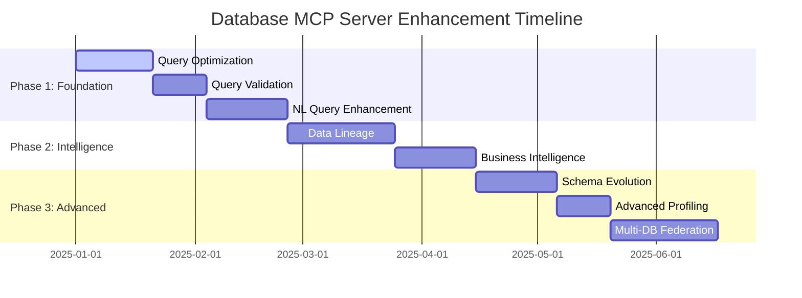

# Database MCP Server - Enhancement Roadmap

## Executive Summary

This roadmap outlines the enhancement plan for the Database MCP Server based on the PRD Analysis Report recommendations. The plan focuses on transforming the current production-ready MCP server into an AI-enhanced database interaction platform with advanced query optimization, natural language processing, and business intelligence capabilities.

## Current State Assessment

### ✅ Strengths
- Production-ready MCP server with 12 comprehensive tools
- Multi-database support (MySQL, MariaDB, PostgreSQL, SQLite)
- Robust security with AES-GCM encryption
- Comprehensive documentation and testing
- Strong architectural foundation with clear separation of concerns

### 🎯 Enhancement Opportunities
The PRD analysis identified 8 key gaps that, when addressed, will significantly enhance AI agent capabilities:
1. Query optimization insights
2. Data lineage and impact analysis
3. Enhanced natural language query processing
4. Automated query validation
5. Business intelligence discovery
6. Schema evolution management
7. Advanced data profiling
8. Multi-database federation

## Implementation Strategy

### Guiding Principles
1. **Incremental Delivery**: Each vertical slice delivers immediate value
2. **Backward Compatibility**: All enhancements maintain existing API compatibility
3. **AI-First Design**: Prioritize features that enhance AI agent capabilities
4. **Performance Focus**: Ensure enhancements don't impact core performance
5. **Security by Default**: Maintain existing security standards for all new features

### Development Phases



## Phase 1: Foundation Enhancements (Immediate - 60 Days)

### Vertical Slice 1.1: Query Optimization Insights
**Timeline**: 21 days
**Priority**: High
**Impact**: High

#### New MCP Tool: `optimize-query`
```json
{
  "name": "optimize-query",
  "description": "Analyze SQL query performance and provide optimization suggestions",
  "parameters": {
    "profile_name": "required",
    "sql": "required",
    "analysis_level": "basic|detailed|comprehensive"
  },
  "response": {
    "execution_plan": "EXPLAIN output",
    "optimization_suggestions": ["Add index on column", "Rewrite JOIN order"],
    "performance_impact": "estimated_improvement_percentage",
    "alternative_queries": ["optimized_sql_variants"]
  }
}
```

#### Implementation Tasks
1. **Core Engine Development** (7 days)
   - Create `internal/mcp/query_optimizer.go`
   - Implement EXPLAIN query parsing for all database types
   - Build optimization rule engine
   - Add performance impact estimation algorithms

2. **Database-Specific Optimizations** (5 days)
   - MySQL/MariaDB optimization rules
   - PostgreSQL optimization rules
   - SQLite optimization rules
   - Index recommendation algorithms

3. **MCP Integration** (4 days)
   - Add handler to `server.go`
   - Implement request/response structures
   - Add comprehensive error handling
   - Create unit tests

4. **Testing & Documentation** (5 days)
   - Integration tests with sample databases
   - Performance benchmarking
   - Update API documentation
   - Create usage examples

#### Files to Modify
- `internal/mcp/server.go` - Add handleOptimizeQuery
- `internal/mcp/query_optimizer.go` - New file
- `internal/mcp/server_test.go` - Add tests
- `docs/api-documentation.md` - Update API docs
- `README.md` - Add tool documentation

### Vertical Slice 1.2: Query Validation Framework
**Timeline**: 14 days
**Priority**: Medium
**Impact**: High

#### New MCP Tool: `validate-query`
```json
{
  "name": "validate-query",
  "description": "Validate SQL syntax and logic without execution",
  "parameters": {
    "profile_name": "required",
    "sql": "required",
    "validation_level": "syntax|logic|performance"
  },
  "response": {
    "is_valid": true/false,
    "syntax_errors": ["list"],
    "logic_warnings": ["potential_issues"],
    "performance_risks": ["list"]
  }
}
```

#### Implementation Tasks
1. **Validation Engine** (6 days)
   - SQL parser integration
   - Syntax validation rules
   - Logic checking algorithms
   - Performance risk detection

2. **MCP Integration** (3 days)
   - Handler implementation
   - Error handling
   - Response formatting

3. **Testing & Documentation** (5 days)
   - Test cases for invalid queries
   - Documentation updates
   - Integration tests

### Vertical Slice 1.3: Enhanced Natural Language Query Processing
**Timeline**: 21 days
**Priority**: High
**Impact**: High

#### Enhancement to Existing: `smart-query-builder`

#### Implementation Tasks
1. **Context Management System** (7 days)
   - Session context tracking
   - Conversation history management
   - Business context integration

2. **Intent Classification Engine** (6 days)
   - Natural language processing
   - Query intent recognition
   - Entity extraction

3. **Multi-turn Conversation** (5 days)
   - Follow-up question handling
   - Clarification request system
   - Context-aware query refinement

4. **Integration & Testing** (3 days)
   - Integration with existing smart-query-builder
   - Comprehensive testing
   - Documentation updates

## Phase 2: Intelligence Layer (60-90 Days)

### Vertical Slice 2.1: Data Lineage and Impact Analysis
**Timeline**: 28 days
**Priority**: High
**Impact**: High

#### New MCP Tool: `analyze-data-lineage`
```json
{
  "name": "analyze-data-lineage",
  "description": "Trace data dependencies and impact relationships",
  "parameters": {
    "profile_name": "required",
    "table_name": "required",
    "analysis_scope": "upstream|downstream|both"
  },
  "response": {
    "data_flow": ["source_tables", "transformations", "target_tables"],
    "impact_analysis": {
      "change_impact": "high|medium|low",
      "affected_tables": ["list"],
      "critical_dependencies": ["list"]
    }
  }
}
```

#### Implementation Tasks
1. **Dependency Graph Engine** (10 days)
   - Foreign key relationship mapping
   - View dependency tracking
   - Stored procedure analysis
   - Application-level dependency detection

2. **Impact Analysis Algorithms** (8 days)
   - Change impact assessment
   - Critical path identification
   - Risk scoring algorithms

3. **Visualization & Reporting** (6 days)
   - Graph visualization data structures
   - Impact report generation
   - Export functionality

4. **Integration & Testing** (4 days)
   - MCP integration
   - Performance testing
   - Documentation

### Vertical Slice 2.2: Business Intelligence Discovery
**Timeline**: 21 days
**Priority**: Medium
**Impact**: High

#### New MCP Tool: `discover-insights`
```json
{
  "name": "discover-insights",
  "description": "Automatically discover business insights and KPIs",
  "parameters": {
    "profile_name": "required",
    "table_names": ["optional"],
    "analysis_type": "kpi|trends|anomalies|correlations"
  },
  "response": {
    "insights": [
      {
        "type": "kpi|trend|anomaly",
        "description": "natural_language_explanation",
        "supporting_data": "summary_statistics",
        "visualization_suggestion": "chart_type"
      }
    ]
  }
}
```

#### Implementation Tasks
1. **Statistical Analysis Engine** (8 days)
   - KPI detection algorithms
   - Trend analysis
   - Anomaly detection
   - Correlation analysis

2. **Natural Language Generation** (6 days)
   - Insight description generation
   - Business context integration
   - Multi-language support foundation

3. **Visualization Integration** (4 days)
   - Chart type recommendation
   - Data structure for visualization
   - Export capabilities

4. **Testing & Documentation** (3 days)

## Phase 3: Advanced Features (90+ Days)

### Vertical Slice 3.1: Schema Evolution Management
**Timeline**: 21 days
**Priority**: Medium
**Impact**: Medium

#### New MCP Tool: `track-schema-changes`
```json
{
  "name": "track-schema-changes",
  "description": "Track and analyze schema evolution over time",
  "parameters": {
    "profile_name": "required",
    "time_range": "optional",
    "change_types": ["add|drop|modify"]
  },
  "response": {
    "changes": [
      {
        "timestamp": "ISO_date",
        "change_type": "add|drop|modify",
        "object_type": "table|column|index",
        "object_name": "name",
        "impact_assessment": "breaking|non_breaking"
      }
    ],
    "migration_suggestions": ["sql_statements"]
  }
}
```

### Vertical Slice 3.2: Advanced Data Profiling
**Timeline**: 14 days
**Priority**: Low
**Impact**: Medium

#### Enhancement to Existing: `analyze-schema`

### Vertical Slice 3.3: Multi-Database Federation
**Timeline**: 28 days
**Priority**: Low
**Impact**: High

#### New MCP Tool: `federated-query`
```json
{
  "name": "federated-query",
  "description": "Execute queries across multiple database profiles",
  "parameters": {
    "profile_names": ["required", "array"],
    "query": "required",
    "join_strategy": "local|remote|hybrid"
  },
  "response": {
    "results": "combined_dataset",
    "execution_plan": "distributed_execution_details",
    "performance_metrics": "timing_breakdown"
  }
}
```

## Technical Architecture Enhancements

### New Components

#### 1. Query Optimization Engine
```
internal/mcp/
├── query_optimizer.go          # Core optimization logic
├── query_validator.go          # Validation framework
├── lineage_analyzer.go         # Data lineage engine
├── bi_discovery.go            # Business intelligence
├── schema_tracker.go          # Schema evolution
└── federation_engine.go      # Multi-DB federation
```

#### 2. Context Management System
```
internal/mcp/
├── context/
│   ├── manager.go            # Session context management
│   ├── conversation.go       # Conversation history
│   └── business_context.go   # Business domain context
```

#### 3. Analytics Engine
```
internal/mcp/
├── analytics/
│   ├── statistics.go         # Statistical analysis
│   ├── patterns.go          # Pattern recognition
│   ├── trends.go            # Trend analysis
│   └── anomalies.go         # Anomaly detection
```

### Database Extensions

#### Enhanced Metadata Collection
- Extended information_schema queries
- Custom metadata storage
- Historical data tracking
- Performance metrics collection

#### New Configuration Options
```yaml
# Enhanced configuration
features:
  query_optimization: true
  data_lineage: true
  business_intelligence: true
  schema_tracking: true

analytics:
  retention_days: 90
  aggregation_level: "daily"
  
context:
  session_timeout: "1h"
  max_history_items: 100
```

## Implementation Dependencies

### External Libraries
- **SQL Parsing**: github.com/xwb1989/sqlparser or similar
- **Statistical Analysis**: gonum.org/v1/gonum/stat
- **Graph Processing**: github.com/yourbasic/graph
- **NLP**: Integration with external NLP service or library

### Database Requirements
- Extended permissions for performance analysis
- Additional system tables for metadata storage
- Configuration for query logging

## Risk Assessment & Mitigation

### Technical Risks
1. **Performance Impact**: Mitigate with caching and lazy loading
2. **Complexity**: Manage with modular design and comprehensive testing
3. **Database Compatibility**: Ensure abstraction layers handle differences

### Operational Risks
1. **Resource Usage**: Monitor and optimize resource consumption
2. **Security**: Maintain existing security standards for new features
3. **Backward Compatibility**: Ensure all changes are non-breaking

## Success Metrics

### Technical Metrics
- Query optimization improvement percentage
- Validation accuracy rate
- Data lineage coverage
- Performance impact of new features

### Business Metrics
- AI agent query success rate
- User satisfaction with natural language queries
- Time-to-insight reduction
- Adoption rate of new features

## Next Steps

1. **Immediate Actions (Week 1)**
   - Set up development environment for Phase 1
   - Create detailed technical specifications
   - Begin core query optimization engine development

2. **Short-term (Month 1)**
   - Complete query optimization tool
   - Begin query validation framework
   - Start natural language enhancement design

3. **Medium-term (Months 2-3)**
   - Complete Phase 1 deliverables
   - Begin Phase 2 planning and development
   - Gather feedback from early adopters

4. **Long-term (Months 3+)**
   - Execute Phase 2 and 3 according to roadmap
   - Continuous improvement based on usage patterns
   - Explore additional enhancement opportunities

## Conclusion

This roadmap provides a structured approach to enhancing the Database MCP Server with AI-focused capabilities while maintaining the existing robust foundation. The vertical slice approach ensures each phase delivers immediate value while building toward a comprehensive database interaction platform for AI agents.

The plan balances technical feasibility with business impact, prioritizing features that will most significantly enhance AI agent capabilities while ensuring the system remains performant, secure, and maintainable.