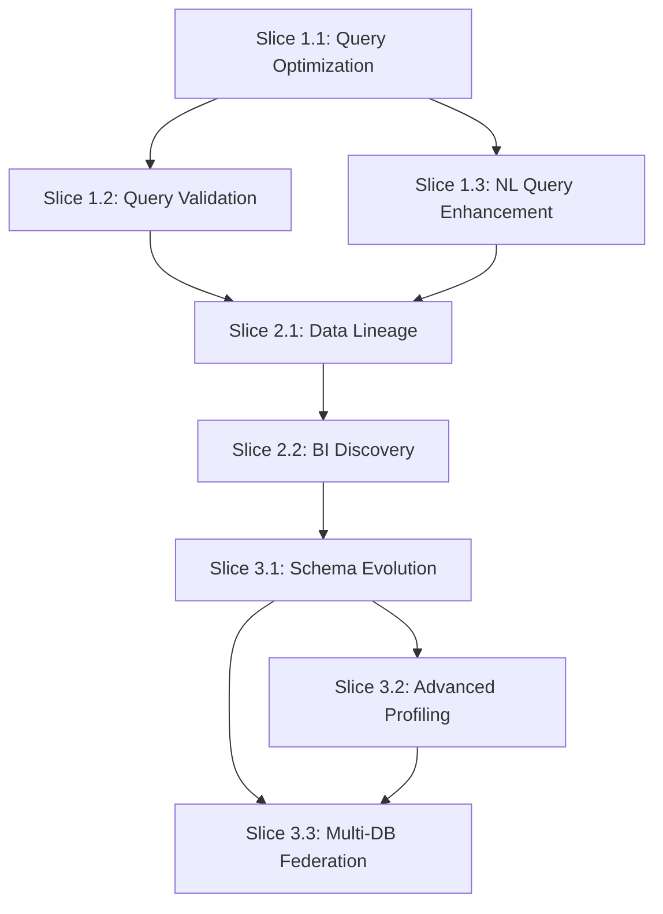

# Database MCP Server - Vertical Slices Definition

## Overview

This document defines the vertical slices for implementing the Database MCP Server enhancements. Each vertical slice is designed to be a complete, end-to-end implementation that delivers immediate value while building toward the comprehensive roadmap goals.

## Vertical Slice Philosophy

### Principles
1. **Complete Functionality**: Each slice delivers fully working features
2. **Immediate Value**: Users can benefit from each slice independently
3. **Incremental Building**: Each slice builds upon previous capabilities
4. **Minimal Dependencies**: Slices minimize cross-dependencies where possible
5. **Testable Units**: Each slice can be thoroughly tested in isolation

### Slice Structure
Each vertical slice includes:
- **New MCP Tools**: Complete implementations with full documentation
- **Enhanced Existing Tools**: Improvements to current functionality
- **Backend Components**: New internal modules and services
- **Testing Suite**: Unit, integration, and end-to-end tests
- **Documentation**: API docs, user guides, and examples
- **Configuration**: Any new configuration options or requirements

## Phase 1 Vertical Slices

### Slice 1.1: Query Optimization Insights

#### Scope
Deliver intelligent query optimization capabilities that help AI agents and developers improve SQL performance.

#### Deliverables

**New MCP Tool: `optimize-query`**
- Analyze SQL queries using database EXPLAIN functionality
- Provide optimization suggestions based on query patterns
- Estimate performance improvements
- Generate alternative query formulations

**Backend Components**
- `internal/mcp/query_optimizer.go` - Core optimization engine
- `internal/mcp/optimization_rules.go` - Database-specific rules
- `internal/mcp/performance_estimator.go` - Impact estimation

**Configuration Extensions**
```yaml
optimization:
  enabled: true
  cache_size: 100
  max_analysis_time: "30s"
  enable_cost_estimation: true
```

**Testing**
- Unit tests for optimization algorithms
- Integration tests with all database types
- Performance benchmarks
- Validation of optimization suggestions

#### Success Criteria
- Analyze 95% of common SQL query patterns
- Provide actionable optimization suggestions in 80% of cases
- Complete analysis within 30 seconds for complex queries
- Maintain 99% accuracy in optimization recommendations

#### Dependencies
- Database EXPLAIN functionality access
- Query parsing capabilities
- Performance baseline data

---

### Slice 1.2: Query Validation Framework

#### Scope
Implement comprehensive SQL query validation that prevents errors before execution.

#### Deliverables

**New MCP Tool: `validate-query`**
- SQL syntax validation without execution
- Logic error detection (missing joins, invalid references)
- Performance risk assessment
- Security vulnerability scanning

**Backend Components**
- `internal/mcp/query_validator.go` - Core validation engine
- `internal/mcp/syntax_checker.go` - Syntax validation
- `internal/mcp/logic_analyzer.go` - Logic checking
- `internal/mcp/security_scanner.go` - Security validation

**Configuration Extensions**
```yaml
validation:
  enabled: true
  syntax_check: true
  logic_check: true
  security_scan: true
  max_validation_time: "10s"
```

**Testing**
- Invalid SQL query test cases
- Logic error detection validation
- Security vulnerability test suite
- Performance under load testing

#### Success Criteria
- Detect 99% of syntax errors
- Identify 85% of common logic errors
- Complete validation within 10 seconds
- Zero false positives for critical errors

#### Dependencies
- SQL parser integration
- Security rule definitions
- Logic validation patterns

---

### Slice 1.3: Enhanced Natural Language Query Processing

#### Scope
Transform the existing smart-query-builder into a context-aware, conversational query interface.

#### Deliverables

**Enhanced MCP Tool: `smart-query-builder`**
- Multi-turn conversation support
- Context-aware query generation
- Business domain understanding
- Query intent classification

**New Backend Components**
- `internal/mcp/context/manager.go` - Session context management
- `internal/mcp/nlp/intent_classifier.go` - Intent recognition
- `internal/mcp/nlp/entity_extractor.go` - Entity extraction
- `internal/mcp/context/conversation.go` - Conversation history

**Configuration Extensions**
```yaml
nlp:
  enabled: true
  context_timeout: "1h"
  max_conversation_length: 20
  business_domains: ["ecommerce", "finance", "healthcare"]
```

**Testing**
- Conversation flow testing
- Context persistence validation
- Intent classification accuracy
- End-to-end query generation tests

#### Success Criteria
- Maintain conversation context across 10+ turns
- Classify query intent with 90% accuracy
- Generate correct SQL 85% of the time for common queries
- Handle domain-specific terminology accurately

#### Dependencies
- NLP service or library integration
- Context storage mechanism
- Business domain definitions

## Phase 2 Vertical Slices

### Slice 2.1: Data Lineage and Impact Analysis

#### Scope
Enable AI agents to understand data dependencies and predict change impacts across the database ecosystem.

#### Deliverables

**New MCP Tool: `analyze-data-lineage`**
- Trace upstream and downstream data dependencies
- Analyze impact of proposed changes
- Identify critical data paths
- Generate dependency graphs

**Backend Components**
- `internal/mcp/lineage/analyzer.go` - Core lineage engine
- `internal/mcp/lineage/dependency_graph.go` - Graph management
- `internal/mcp/lineage/impact_assessor.go` - Impact analysis
- `internal/mcp/lineage/visualizer.go` - Graph visualization data

**Configuration Extensions**
```yaml
lineage:
  enabled: true
  auto_discovery: true
  cache_dependencies: true
  include_views: true
  include_procedures: true
```

**Testing**
- Dependency graph accuracy testing
- Impact analysis validation
- Performance with large schemas
- Complex relationship handling

#### Success Criteria
- Discover 95% of data dependencies automatically
- Generate accurate impact assessments
- Handle schemas with 1000+ tables efficiently
- Complete lineage analysis within 60 seconds

#### Dependencies
- Schema metadata access
- Relationship detection algorithms
- Graph processing capabilities

---

### Slice 2.2: Business Intelligence Discovery

#### Scope
Automatically discover business insights, KPIs, and trends from database data.

#### Deliverables

**New MCP Tool: `discover-insights`**
- Automated KPI detection
- Trend analysis and forecasting
- Anomaly detection
- Correlation analysis

**Backend Components**
- `internal/mcp/analytics/statistics.go` - Statistical analysis
- `internal/mcp/analytics/trend_analyzer.go` - Trend detection
- `internal/mcp/analytics/anomaly_detector.go` - Anomaly detection
- `internal/mcp/analytics/kpi_discovery.go` - KPI identification

**Configuration Extensions**
```yaml
analytics:
  enabled: true
  sample_size: 10000
  confidence_threshold: 0.95
  trend_sensitivity: "medium"
```

**Testing**
- Statistical accuracy validation
- KPI detection accuracy
- Trend analysis precision
- Performance with large datasets

#### Success Criteria
- Identify relevant KPIs with 80% accuracy
- Detect significant trends with 90% precision
- Complete analysis within 2 minutes for typical tables
- Handle time-series data effectively

#### Dependencies
- Statistical analysis libraries
- Sampling algorithms
- Time-series processing capabilities

## Phase 3 Vertical Slices

### Slice 3.1: Schema Evolution Management

#### Scope
Track, analyze, and manage schema changes over time with automated migration assistance.

#### Deliverables

**New MCP Tool: `track-schema-changes`**
- Schema change history tracking
- Impact assessment for schema modifications
- Automated migration suggestion generation
- Change validation and rollback support

**Backend Components**
- `internal/mcp/schema/tracker.go` - Change tracking
- `internal/mcp/schema/comparator.go` - Schema comparison
- `internal/mcp/schema/migrator.go` - Migration generation
- `internal/mcp/schema/validator.go` - Change validation

**Configuration Extensions**
```yaml
schema_tracking:
  enabled: true
  retention_days: 365
  auto_snapshot: true
  change_validation: true
```

**Testing**
- Change detection accuracy
- Migration generation correctness
- Rollback functionality
- Performance with large schemas

#### Success Criteria
- Detect all schema changes automatically
- Generate correct migration scripts 95% of the time
- Complete change analysis within 30 seconds
- Support rollback for 90% of changes

#### Dependencies
- Schema snapshot storage
- Comparison algorithms
- Migration pattern library

---

### Slice 3.2: Advanced Data Profiling

#### Scope
Extend existing analyze-schema with advanced statistical analysis and data quality metrics.

#### Deliverables

**Enhanced MCP Tool: `analyze-schema`**
- Statistical distribution analysis
- Outlier detection and reporting
- Data quality scoring
- Completeness and consistency assessment

**Backend Components**
- `internal/mcp/profiling/statistics.go` - Advanced statistics
- `internal/mcp/profiling/quality_scorer.go` - Quality metrics
- `internal/mcp/profiling/outlier_detector.go` - Outlier detection
- `internal/mcp/profiling/completeness.go` - Completeness analysis

**Configuration Extensions**
```yaml
profiling:
  advanced_stats: true
  outlier_detection: true
  quality_scoring: true
  sample_size: "auto"
```

**Testing**
- Statistical accuracy validation
- Outlier detection precision
- Quality scoring relevance
- Performance optimization

#### Success Criteria
- Generate accurate statistical profiles
- Detect outliers with 85% precision
- Provide meaningful quality scores
- Complete analysis within 45 seconds

#### Dependencies
- Statistical analysis algorithms
- Quality metric definitions
- Sampling strategies

---

### Slice 3.3: Multi-Database Federation

#### Scope
Enable querying across multiple database instances with intelligent distributed execution.

#### Deliverables

**New MCP Tool: `federated-query`**
- Cross-database query execution
- Intelligent join strategy selection
- Result aggregation and merging
- Distributed query optimization

**Backend Components**
- `internal/mcp/federation/engine.go` - Federation core
- `internal/mcp/federation/planner.go` - Query planning
- `internal/mcp/federation/executor.go` - Distributed execution
- `internal/mcp/federation/aggregator.go` - Result merging

**Configuration Extensions**
```yaml
federation:
  enabled: true
  max_concurrent_queries: 10
  result_merge_strategy: "auto"
  cross_db_joins: true
```

**Testing**
- Cross-database query accuracy
- Performance under load
- Join strategy optimization
- Error handling and recovery

#### Success Criteria
- Execute accurate cross-database queries
- Optimize join strategies automatically
- Complete queries within 2x single-database time
- Handle connection failures gracefully

#### Dependencies
- Multiple database connections
- Distributed execution framework
- Result merging algorithms

## Implementation Dependencies Graph



## Resource Allocation

### Development Team Structure
- **Core Backend Developer**: Primary implementation of all slices
- **Database Specialist**: Query optimization and federation features
- **Analytics Engineer**: BI discovery and data profiling
- **DevOps Engineer**: Deployment and monitoring setup

### Time Allocation per Phase
- **Phase 1**: 60 days (3 slices × 20 days each)
- **Phase 2**: 49 days (2 slices × 24.5 days each)
- **Phase 3**: 63 days (3 slices × 21 days each)

### Risk Mitigation per Slice
1. **Technical Risk**: Proof-of-concept before full implementation
2. **Integration Risk**: Comprehensive testing at each slice boundary
3. **Performance Risk**: Benchmarking and optimization in each slice
4. **Dependency Risk**: Alternative approaches for external dependencies

## Success Metrics per Slice

### Phase 1 Metrics
- Query optimization accuracy and performance improvement
- Validation error detection rate and false positive rate
- Natural language query success rate and context retention

### Phase 2 Metrics
- Data lineage coverage and accuracy
- Business insight relevance and discovery rate
- Impact analysis precision and recall

### Phase 3 Metrics
- Schema change detection and migration success rate
- Data profiling completeness and quality score accuracy
- Federation query performance and accuracy

## Conclusion

This vertical slice approach ensures that each enhancement delivers immediate value while building toward a comprehensive AI-enhanced database interaction platform. The modular nature allows for flexible implementation scheduling and risk mitigation while maintaining clear deliverables and success criteria.